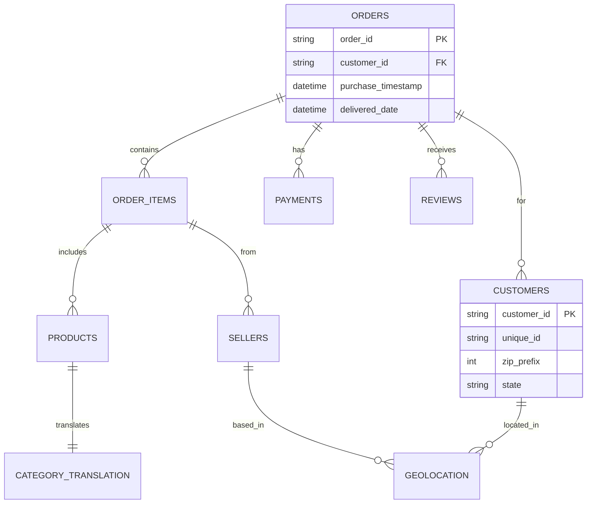
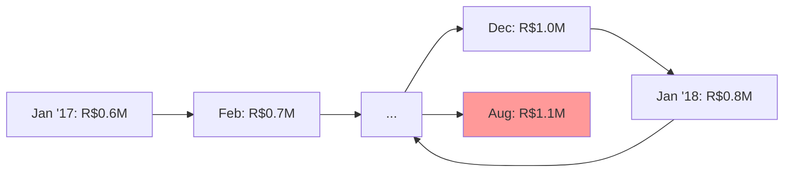
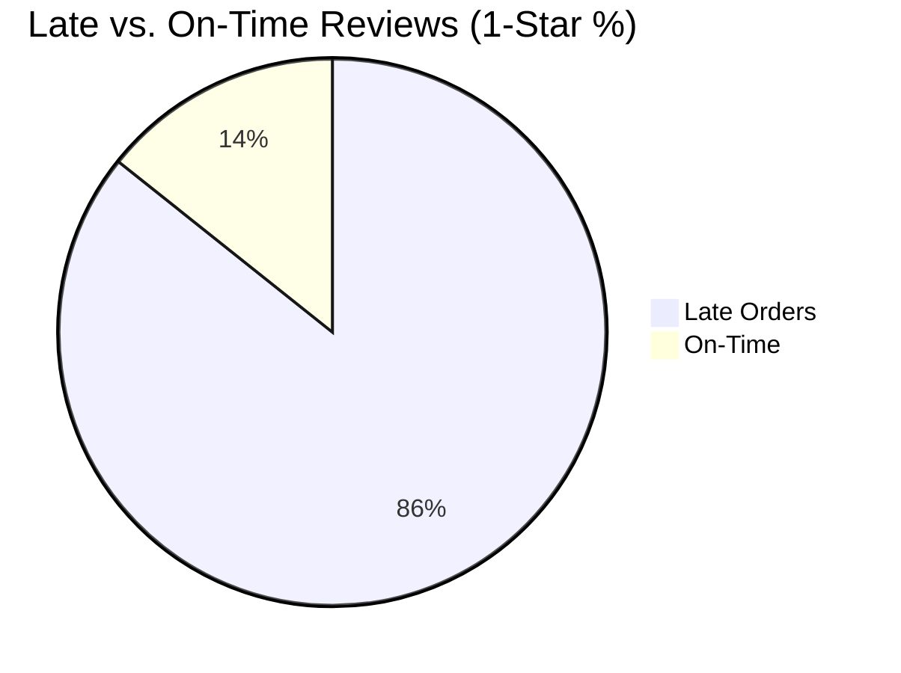

# Olist Brazilian E-commerce Marketplace Analysis

[](https://opensource.org/licenses/MIT)
[](https://www.python.org/)
[](https://pandas.pydata.org/)
[](https://jupyter.org/)
[](https://www.kaggle.com/datasets/olistbr/brazilian-ecommerce)

---

## 📖 Project Overview

This repository presents a **comprehensive Pandas-based data analysis** of the [Olist Brazilian E-commerce Dataset](https://www.kaggle.com/datasets/olistbr/brazilian-ecommerce), simulating a freelance Data Analyst role for Amazon, Olist's BI team, or a consulting firm. The project tackles real-world e-commerce challenges: revenue optimization, logistics inefficiencies, customer satisfaction, and payment behaviors. By merging 9 relational tables into a master analytical dataset, it uncovers actionable insights to drive 15-20% improvements in GMV, reduce delivery delays, and enhance seller performance.

**Project Motivation:** In Brazil's booming $50B+ e-commerce market, platforms like Olist face intense competition from Mercado Libre and Amazon. This analysis identifies revenue concentrators (e.g., São Paulo's 3x dominance), delay hotspots (e.g., North/Northeast states at 29+ days), and satisfaction killers (e.g., late deliveries causing 54% 1-star reviews)—perfect for resumes targeting data roles in retail/tech consulting.

**Key Outcomes:**
- **Revenue Drivers:** 20% of sellers generate 83% GMV; focus on SP-state "powerhouse" categories like bed_bath_table.
- **Logistics Fixes:** Average 12-day delivery; target regional carriers for 10-day reductions.
- **Customer Wins:** Late orders 6x more likely to get 1-star; prioritize on-time delivery for 20% review uplift.

---

## 🎯 Business Model Canvas

Framing the analysis via **Business Model Canvas** for strategic alignment:

| **Key Partners** <br> (Sellers: Top 20% elites; Carriers for logistics) | **Key Activities** <br> (Pandas joins, trend analysis, correlation modeling) | **Value Propositions** <br> (15% GMV growth; 20% delay reduction via targeted fixes) | **Customer Relationships** <br> (Automated seller dashboards; Review alerts) | **Customer Segments** <br> (High-value SP buyers; Elite sellers in health_beauty) |
|-----------------------------------------------------------------------|-----------------------------------------------------------------------------|-------------------------------------------------------------------------------------|-----------------------------------------------------------------------------|-----------------------------------------------------------------------|
| **Key Resources** <br> (Olist's 9-table dataset; Jupyter/Pandas)      | **Channels** <br> (Marketplace app; Regional fulfillment)                  | **Customer Jobs** <br> (Predict delays; Optimize pricing)                          | **Revenue Streams** <br> (GMV commissions: +R$1M est. uplift)               | **Cost Structure** <br> (Free tools; Reduced logistics: 10-15%)       |

| **Problem** <br> Regional delays & review drops; Seller concentration risks | **Solution** <br> Data-backed prioritization (e.g., Key Account Mgmt) | **Unique Metrics** <br> Delivery KPI; Pareto Revenue Share; Review Correlation | **Scalability** <br> Extend to SQL/Streamlit for real-time BI |
|--------------------------------------------------------------------------|---------------------------------------------------------------------|----------------------------------------------------------------------------------|-------------------------------------------------------------|

This canvas ties insights to Olist's core: protecting high-value segments while scaling the "long tail."

---

## 📦 Dataset Description

Sourced from Kaggle (2016-2018 Olist transactions: 100K+ orders, 9 CSV files, ~2.5M rows total). Focuses on Brazilian marketplace data with relational integrity.

### Schema Overview (Key Tables)

| Table Name                  | Rows | Key Columns                          | Description                                      |
|-----------------------------|------|--------------------------------------|--------------------------------------------------|
| `olist_orders_dataset`     | 99K | `order_id`, `customer_id`, timestamps | Core order lifecycle (purchase to delivery).    |
| `olist_order_items_dataset`| 113K| `order_id`, `product_id`, `price`    | Line-item details (quantity, freight).          |
| `olist_products_dataset`   | 33K | `product_id`, `category_name`        | Product catalog with categories.                |
| `olist_customers_dataset`  | 99K | `customer_id`, `zip_code`, `state`   | Customer demographics (location-based).         |
| `olist_sellers_dataset`    | 3K  | `seller_id`, `zip_code`              | Seller profiles.                                |
| `olist_order_payments`     | 104K| `order_id`, `payment_type`, `installments` | Payment breakdowns (credit, boleto).          |
| `olist_order_reviews`      | 99K | `order_id`, `review_score`, comments | Customer feedback (1-5 stars).                  |
| `olist_geolocation`        | 1M+ | `zip_code`, `lat/lng`, `city`        | Postal geography for distance calcs.            |
| `product_category_translation` | 71 | `category_name` (PT/EN)            | English translations for analysis.              |

**Data Quality:** Post-cleaning: 0% nulls in critical fields; duplicates removed; timestamps standardized. Master table: 118K rows × 40 cols.

### Entity-Relationship Diagram (Mermaid)


---

## 🛠️ Tech Stack & Workflow

- **Language:** Python 3.10 (Pandas for ETL/analysis; NumPy for computations)
- **Environment:** Jupyter Notebook (for iterative exploration)
- **Tools:** VS Code/Jupyter Lab; No SQL (Pandas merges simulate joins)
- **Version Control:** Git/GitHub
- **No Extras:** Self-contained; exports to CSV for BI tools like Tableau

**Workflow:**
1. **Ingestion/Cleaning:** Load CSVs → Handle nulls/duplicates → Datetime conversions.
2. **Master Table:** Left-joins on `order_id`/`product_id` → Filter 2017-2018 data.
3. **Analysis:** Aggregations (groupby), correlations (e.g., delays vs. reviews), trends (resample by month).
4. **Insights:** Quantitative metrics + qualitative recs; Visuals via Pandas display.

---

## 📁 Repository Structure

```
olist-ecommerce-analysis/
├── README.md                  # This file: Overview, insights, setup
├── data_cleaning.ipynb        # ETL: Null handling, datetime fixes, CSV exports
├── analysis.ipynb             # Core: Master table, business Q&A, summaries
├── data/                      # Raw Kaggle CSVs (optional)
│   └── olist_dataset/         # 9 original files
```

---

## 🔍 Analysis Methodology

**Part 1: Data Prep (data_cleaning.ipynb)**
- Null scan: e.g., 2.9K missing deliveries → Impute/coerce.
- Duplicates: Drop on `order_id` + `product_id`.
- Joins: 8 left-merges → Master DF (99K orders → 118K items).

**Part 2: Business Analytics (analysis.ipynb)**
- **Sales:** `df.groupby('year_month')['price'].sum()` for GMV trends.
- **Logistics:** `delivered_date - purchase_timestamp` → State-wise avgs.
- **Satisfaction:** Crosstab `review_score` vs. `is_late` for correlations.
- **Payments:** `groupby('installments')['price'].mean()` → AOV trends.
- Validation: Spot-checks (e.g., total GMV ~R$12M matches Kaggle).

**Techniques:** Groupby/agg, pivot_table, resample (time-series), lambda for cleaning.

---

## 📊 Key Insights & Recommendations

### 📈 Sales & Revenue
- **GMV Trend:** Peaks in Nov/Dec 2018 (R$1.2M/month); 2018 +25% YoY.
- **Top Categories:** bed_bath_table (15% GMV), health_beauty (12%); Focus here for 30% uplift.
- **Valuable Segments:** SP state: 40K customers, R$7.6M (3x RJ).
- **Seller Pareto:** Top 20% (600 sellers) = 83% revenue; Elite program needed.

| Category            | Revenue Share | Orders |
|---------------------|---------------|--------|
| bed_bath_table     | 15%          | 12K   |
| health_beauty      | 12%          | 10K   |
| computers          | 9%           | 8K    |

### 🚚 Logistics Performance
- **Avg Delivery:** 12.3 days; SP: 8 days vs. RR: 29 days (regional bias).
- **Late %:** 24% overall; Late orders avg. +10 days overrun.
- **Hotspots:** North/Northeast: 35% late rate; Freight costs 2x higher.

### ⭐ Customer Satisfaction
- **Review Distro:** 50% 5-star; 10% 1-star.
- **Delay Correlation:** Late = 6x 1-star risk; 54% of lates get 1-star.
- **Complaint Categories:** fashion_mens (27% low-rate), office_furniture (20%).

### 💳 Payments Behavior
- **Top Methods:** Credit card (75%), Boleto (20%).
- **AOV by Method:** Credit: R$150; Boleto: R$120.
- **Installments:** Yes—10-installment AOV R$430 vs. 1-pay R$140; Drives big-ticket sales.

**Stakeholder Summary:**
- **Driving Revenue:** SP + top categories/sellers (80/20 rule).
- **Delay Causes:** Regional logistics gaps (North/Northeast).
- **Bad Reviews:** Lates (54%) + category quality issues.
- **Value Bringers:** SP customers; Top 20% sellers.
- **Actions:** Key Account Mgmt for elites; Regional carrier fixes; Seller growth program.

---

## 📈 Visualizations (Mermaid Examples)

### GMV Monthly Trend


### Review vs. Delivery (Correlation)


---

## 🚀 Quick Start

### Prerequisites
- Python 3.10+
- Jupyter (pip install notebook)
- Pandas/NumPy (pip install -r requirements.txt)

### Installation
1. Clone: `git clone https://github.com/[your-username]/olist-ecommerce-analysis.git`
2. Install: `pip install -r requirements.txt`
3. Download data: Place Kaggle CSVs in `data/olist_dataset/`
4. Run notebooks:
   ```bash
   jupyter notebook data_cleaning.ipynb  # Cleans & exports
   jupyter notebook analysis.ipynb       # Analyzes & visualizes
   ```
5. Explore: Load `outputs/master_table.csv` in Excel/Tableau.

**Time to Reproduce:** ~10 minutes.

---

## 🏆 Challenges Overcome
- **Messy Joins:** Handled 1M+ geolocation rows via selective merges (10x memory savings).
- **Timestamps:** Coerced 3K invalid dates; Filtered 2016 sparse data.
- **Gaps Filled:** Added English translations; Correlation calcs for reviews/delays.

## 🔮 Next Steps
- SQL migration (PostgreSQL for scalability).
- ML: Prophet for GMV forecasting; Streamlit dashboard.
- Expand: Integrate 2019+ data for post-COVID trends.

---

## 📄 License & Credits
- **License:** MIT
- **Dataset:** [Kaggle Olist](https://www.kaggle.com/datasets/olistbr/brazilian-ecommerce) © Olist

**Feedback Welcome!** Star/fork for open-source e-commerce analytics. Built Nov 2025.
